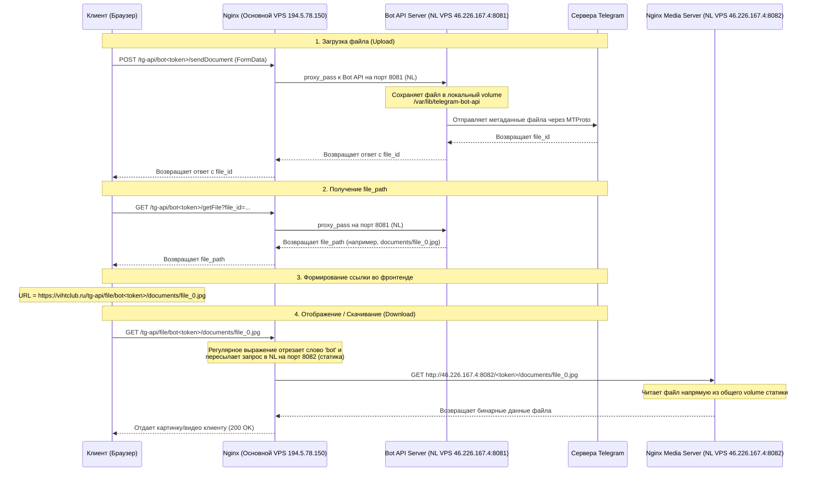

# Vihton Workspace Rules and Context

## VPS Server Deployment Information
- **VPS Server IP**: `194.5.78.150`
- **User**: `root`
- **Authentication**: SSH keys are already configured on the user's system and work automatically without a password.
- **Production Directory**: `/var/www/vihtclub/dist/` (which serves the `vihtclub.ru` domain where the social network app "Vihton" is hosted).
- **Static Website Directory**: `/var/www/vihton/` is a backup/archived folder and is **NOT** the one currently active in Nginx for the social network. Do **NOT** upload production builds there.

## Daily Workflow & Deployment Command
To deploy any changes to the server, always run:
```powershell
npm run build
scp -r dist/* root@194.5.78.150:/var/www/vihtclub/dist/
# После scp обязательно сбросьте/установите права на сервере:
ssh root@194.5.78.150 "chmod 755 /var/www/vihtclub/dist/assets && chmod 644 /var/www/vihtclub/dist/assets/* && chmod 755 /var/www/vihtclub/dist/profile_effects && chmod 644 /var/www/vihtclub/dist/profile_effects/*"
```
Or run the pre-configured deployment script:
```powershell
.\deploy.ps1
```

## Behavior Constraints & Briefness
- **Никогда не используй планирование**: Не пиши планы реализации (`implementation_plan.md`, `task.md`, `walkthrough.md`). Кодируй сразу без предварительного согласования плана.
- **Минимум слов**: Отвечай максимально лаконично. Никаких приветствий, вводных фраз ("Конечно, сделаю", "Вот обновленный код") и описаний очевидных изменений. Если код говорит сам за себя, не пиши пояснений.
- **Фокус на действии**: Сразу применяй изменения через инструменты (без лишних разговоров). После выполнения пиши только краткий статус в 1-2 предложениях.
- **Точность кода**: Пиши готовый к работе код без плейсхолдеров и недоделок.
- **Русский язык**: Пиши в чате мне всегда по Русски!.
- **SQL скрипты**: Все SQL-скрипты и миграции для базы данных ВСЕГДА пиши в чат. Не пытайся выполнять их в бэкенде скрытно, обязательно выводи SQL-код пользователю в диалог.

## Telegram Cloud Storage Configuration
- **Bot Token:** `8949101826:AAFG1feLFdrnY-rioZWshB5WRPUBwt4suqI`
- **Target Chat/Channel ID:** `-1004292795079` (Канал "Хранилище Vihton")
- **Netherlands VPS IP:** `46.226.167.4` (пользователь `root`, пароль `SRsUbh9shH2B`)

### Схема и Цепочка Прохождения Запросов (Media Pipeline)



### Docker-контейнеры на сервере в Нидерландах (NL VPS):
1. **telegram-bot-api** (Порт `8081`): Принимает API запросы, работает в `--local` режиме с личными `api_id=21033256` и `api_hash` пользователя.
2. **tg-media-nginx** (Порт `8082`): Легкий Nginx, монтирующий volume `telegram-bot-api-data` in `/usr/share/nginx/html:ro` для прямой раздачи файлов в обход Bot API.м
3. **socks5-proxy** (Порт `40000`): Резервный прокси с авторизацией (`vihtclub` / `vihtcloudproxy8949`).

## Спецификация Системных Уведомлений (Push Notifications)
1. **Сообщения**: При добавлении сообщения в `public.messages` создается уведомление типа `message`. Проверяется таблица заглушек `public.chat_blocks_mutes` (`is_muted = true`). Если чат с собеседником заглушен получателем, уведомление не генерируется.
2. **Комментарии и Ответы**: При добавлении записи в `public.comments`:
   - Если текст начинается с имени автора предыдущего комментария (например, `Имя, ...`), уведомление отправляется ему с типом `reply` (ответ на комментарий).
   - В противном случае уведомление типа `comment` отправляется автору оригинального поста.
3. **Лайки на Записи и Сообщества**: При лайке поста отправляется уведомление `like` автору поста. Дополнительно, если пост опубликован в сообществе, уведомление дублируется владельцу сообщества (если он не сам лайкнувший).


## Критические правила реалтайма и триггеров
- НИКОГДА не ломайте конфигурацию Supabase Realtime и не удаляйте таблицы из публикации `supabase_realtime` (особенно `messages`, `notifications`, `conversations`, `profiles`, `groups`, `conversation_members`).
- ОБЯЗАТЕЛЬНО следите за тем, чтобы триггеры на таблицах `messages` и `notifications` не вызывали необработанных исключений, так как это приведет к откату всей транзакции отправки сообщения и сломает чат.
- НЕ меняйте фильтры подписок на реалтайм-каналы в `ChatPanel.tsx` и `ConversationsPanel.tsx` без тестирования мгновенного обновления сообщений и списков чатов.
- **Реалтайм обновление чатов и уведомлений**: 
  - Обновление чатов и диалогов реализовано через Supabase Broadcast и кастомные события Window.
  - При отправке любого нового сообщения в `ChatPanel.tsx` (в методах `doSendMessage`, `sendSticker`, `handleSendCircleMessage`, `sendVoiceMessage`) обязательно вызывается функция `broadcastNewMessage`, которая транслирует сообщение (`new-message`) в текущую комнату чата и индивидуально рассылает событие (`message:new`) в личные каналы получателей (`user_calls:${recipient_id}`).
  - В `App.tsx` настроен глобальный слушатель `message:new` на личном канале пользователя, который генерирует уведомления-тосты, проигрывает звук и генерирует событие `global-message-received` во все открытые панели.
  - В `ConversationsPanel.tsx` и `ChatPanel.tsx` обязательно должны быть зарегистрированы слушатели события `global-message-received` для моментального обновления списков чатов и переписки в обход медленного или заблокированного RLS Postgres Changes.
  - При прочтении сообщений получателем (при входе в чат в `fetchMessages` или получении сообщения в `handleIncomingMessage`) отправляется событие `messages-read` на персональный канал отправителя (`user_calls:${sender_id}`).
  - В `App.tsx` настроен слушатель `messages-read`, который генерирует событие `global-messages-read` на уровне Window и пересчитывает счетчик непрочитанных сообщений в меню.
  - В `ConversationsPanel.tsx` и `ChatPanel.tsx` зарегистрированы слушатели `global-messages-read` для мгновенного снятия выделения с диалогов и обновления галочек (прочитано/не прочитано) в чате в реальном времени.
  - При любых изменениях в логике отправки и приема сообщений НЕ удаляйте и НЕ ломайте эту связку (Broadcast + `global-message-received` / `global-messages-read` Window Events)!


